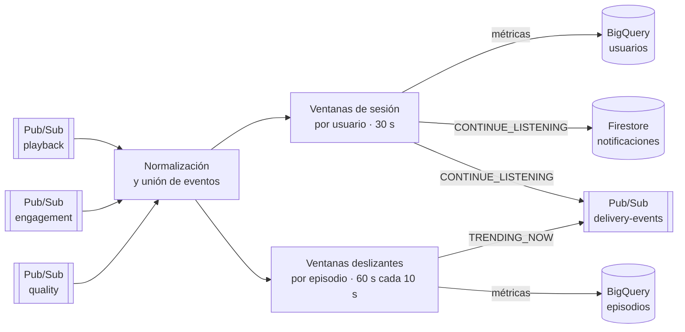

# 🎧 Pipeline de streaming en GCP · Recomendaciones de pódcast en tiempo real


Pipeline de **Dataflow (Apache Beam)** que procesa en tiempo real los eventos de una plataforma de pódcast: reproducciones, interacción y calidad de audio. Calcula métricas por usuario y por episodio, las guarda en **BigQuery** y genera notificaciones personalizadas que se escriben en **Firestore** y se publican en **Pub/Sub**.

Ejercicio del Máster en Big Data y Cloud de EDEM (2025–2026).

---

## Arquitectura



## Qué hace

1. **Ingesta** de tres flujos de eventos desde Pub/Sub y **normalización** a un formato común.
2. **Métricas por usuario** con ventanas de sesión: reproducciones, escuchas completas y una puntuación de interacción.
3. **Métricas por episodio** con ventanas deslizantes, para detectar contenido que sube rápido.
4. **Notificaciones**, separadas de las métricas mediante salidas etiquetadas de Beam:
   - `CONTINUE_LISTENING`: el usuario paró un episodio sin terminarlo; se guarda el minuto exacto para retomarlo.
   - `TRENDING_NOW`: un episodio supera el umbral de reproducciones en la ventana.
5. **Persistencia**: métricas en BigQuery, notificaciones de usuario en Firestore (`users/{user_id}/notifications`) y todas las notificaciones en Pub/Sub para su envío.

## Despliegue

El despliegue está automatizado con **Cloud Build** (`streaming_build.yml`): construye una **Dataflow Flex Template**, sube la imagen a Artifact Registry y lanza el job en streaming.

```bash
gcloud builds submit --config streaming_build.yml .
```

Los nombres de suscripciones, tablas, bucket y región se configuran como *substitutions* en `streaming_build.yml`.

## Estructura

```
├── edem_realtime_recommendation_engine.py   Pipeline de Apache Beam
├── streaming_build.yml                      Build y despliegue con Cloud Build
└── requirements.txt
```

## Autor

**Ricardo Edreira Penas** · Data Analyst · Data Engineer Junior
[LinkedIn](https://www.linkedin.com/in/ricardoedreira) · [GitHub](https://github.com/RicardoEdreiraPenas)
